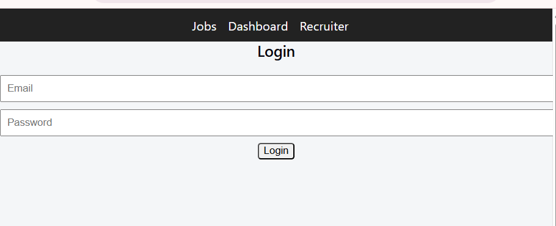

#  Job Portal System (MERN Stack)

A full-stack job portal web application where jobseekers can apply for jobs and recruiters can manage applications.

---

##  Features

###  User (Jobseeker)
- Register & Login
- View jobs
- Apply for jobs
- Track application status

###  Recruiter
- Post jobs
- View applications
- Accept / Reject candidates
- Dashboard stats

---

## Tech Stack

- Frontend: React (Vite)
- Backend: Node.js + Express
- Database: MongoDB Atlas
- Auth: JWT

---

## ⚙️ Installation

### 1️⃣ Backend
cd backend
npm install
npm run dev

### 2 Frontend
 cd frontend
npm install
npm run dev

### Api Base URL

http://localhost:3000/api

### Screenshot

### Author
Deepak Singh